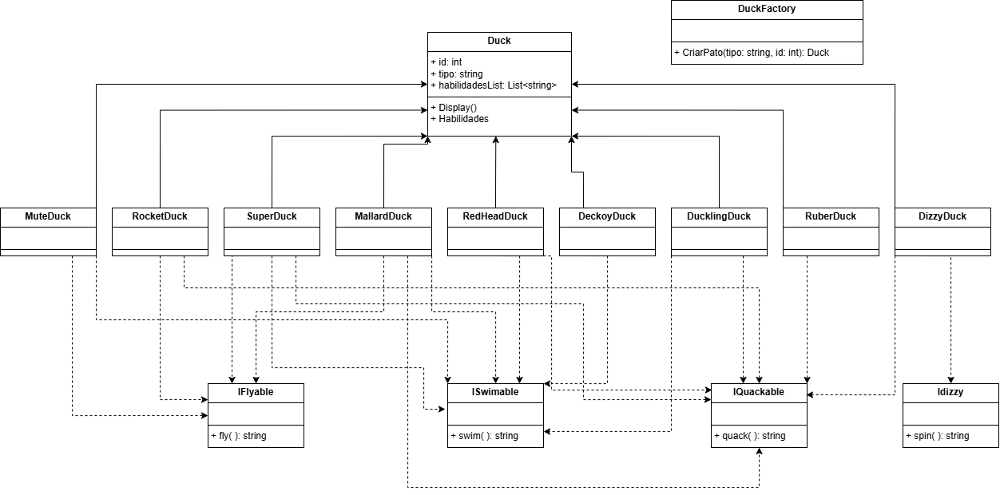

# Simulador de Patos – Aplicação dos Princípios SOLID e Design Patterns

## 1. Introdução ao Projeto

O Simulador de Patos é um sistema desenvolvido em C# (.NET) que simula batalhas de turno entre diferentes tipos de patos, cada um com habilidades e comportamentos próprios. O objetivo é aplicar conceitos de Programação Orientada a Objetos (POO), princípios SOLID e padrões de projeto para criar um código flexível, extensível e de fácil manutenção.

- **Linguagem:** C#
- **Framework:** .NET
- **Padrões de Projeto:** Factory Method, Strategy, Observer, Singleton

## Diagrama de Classe



## 2. Análise dos Princípios SOLID

Nesta seção, explicamos cada princípio SOLID, avaliamos se está aplicado no projeto e apresentamos trechos reais do código.

### SRP – Single Responsibility Principle

O SRP prega que cada classe deve ter apenas uma responsabilidade. Isso facilita a manutenção e evolução do sistema.

- **Está aplicado?** Sim.
- **Exemplo:** A classe [`DuckFactory`](Simulador-de-Patos-Forms/Simulador-de-Patos/Services/DuckFactory.cs) tem a responsabilidade única de criar instâncias de patos.

```csharp
public static class DuckFactory
{
    public static Duck CriarPato(string tipo, int id)
    {
        return tipo switch
        {
            "Pato Selvagem" => new MallardDuck(id),
            // ... outros tipos
            _ => throw new ArgumentException("Tipo de pato desconhecido.")
        };
    }
}
```

### OCP – Open/Closed Principle

O OCP diz que as classes devem ser abertas para extensão, mas fechadas para modificação.

- **Está aplicado?** Parcial
- **Exemplo:** O método `CriarPato` em [`DuckFactory`](Simulador-de-Patos-Forms/Simulador-de-Patos/Services/DuckFactory.cs) permite adicionar novos tipos de patos.

```csharp
public static Duck CriarPato(string tipo, int id)
{
    return tipo switch
    {
        "Pato Selvagem" => new MallardDuck(id),
        // ... outros tipos
        _ => throw new ArgumentException("Tipo de pato desconhecido.")
    };
}
```

### LSP – Liskov Substitution Principle

O LSP afirma que subclasses devem poder ser usadas no lugar de suas superclasses sem causar erros.

- **Está aplicado?** Sim.
- **Exemplo:** Todas as classes de pato herdam de [`Duck`](Simulador-de-Patos-Forms/Simulador-de-Patos/Models/Duck.cs), permitindo substituição sem quebrar o sistema.

```csharp
public abstract class Duck
{
    public int Id { get; }
    public string Tipo { get; }
    public List<string> HabilidadesList { get; } = new List<string>();
    // ...
}

public class DuckLing : Duck, IQuackable, ISwimable
{
    public DuckLing(int id) : base(id, "Pato Filhote")
    {
        HabilidadesList.Add("Swim");
        HabilidadesList.Add("Quack");
    }
    // ...
}
```

### ISP – Interface Segregation Principle

O ISP recomenda que interfaces sejam pequenas e específicas, evitando obrigar classes a implementar métodos que não usam.

- **Está aplicado?** Sim.
- **Exemplo:** Interfaces como [`IQuackable`](Simulador-de-Patos-Forms/Simulador-de-Patos/Interfaces/IQuackable.cs), [`IFlyable`](Simulador-de-Patos-Forms/Simulador-de-Patos/Interfaces/IFlyable.cs), [`IDizzy`](Simulador-de-Patos-Forms/Simulador-de-Patos/Interfaces/IDizzy.cs) são bem segregadas.

```csharp
public interface IQuackable
{
    string quack();
}
public interface ISwimable
{
    string swim();
}
```

### DIP – Dependency Inversion Principle

O DIP sugere que módulos de alto nível não dependam de implementações concretas, mas de abstrações.

- **Está aplicado?** Parcialmente.
- **Exemplo:** As subclasses de pato usam interfaces para comportamentos, mas ainda implementam diretamente esses comportamentos.

```csharp
public class DizzyDuck : Duck, IQuackable, IDizzy
{
    public string quack() => "QuaAaAaCK ele grita girando";
    public string spin() => "Rodando e dando soco para todo lado";
}
```

- **Sugestão:** Separar os comportamentos em classes e coloca-los nos patos, para depender apenas de abstrações.

## 3. Demonstração Prática

### Strategy

O padrão Strategy permite definir uma família de algoritmos (ou comportamentos), encapsulá-los em classes separadas e torná-los intercambiáveis em tempo de execução. No contexto do simulador, cada pato pode ter diferentes estratégias de comportamento (como voar, nadar ou gritar), e essas estratégias podem ser implementadas via interfaces e classes distintas.

**Exemplo aplicado:**
Veja a classe [`DizzyDuck`](Simulador-de-Patos-Forms/Simulador-de-Patos/Models/DizzyDuck.cs), que implementa comportamentos via interfaces:

```csharp
public class DizzyDuck : Duck, IQuackable, IDizzy {
    public string quack() => "QuaAaAaCK ele grita girando";
    public string spin() => "Rodando e dando soco para todo lado";
}
```

### Factory Method

O padrão Factory Method fornece uma interface para criar objetos em uma superclasse, mas permite que subclasses alterem o tipo de objetos que serão criados. No projeto, a classe `DuckFactory` centraliza a criação dos diferentes tipos de patos, facilitando a manutenção e extensão do sistema.

**Exemplo aplicado:**
Veja [`DuckFactory`](Simulador-de-Patos-Forms/Simulador-de-Patos/Services/DuckFactory.cs):

```csharp
public static Duck CriarPato(string tipo, int id) {
    return tipo switch {
        "Pato Selvagem" => new MallardDuck(id),
        // ... outros tipos
        _ => throw new ArgumentException("Tipo de pato desconhecido.")
    };
}
```

## 4. Conclusão

### Experiências e Aprendizados

No início, foi desafiador organizar o projeto e aplicar padrões, especialmente ao estruturar pastas e arquivos. Tivemos dificuldades com dependências entre arquivos, mas, ao migrar para Forms, a organização prévia facilitou bastante a adaptação e integração dos componentes, fora que se precisarmos alterar ou mudar algo agora fazemos isso com bastante facilidade sem comprometer o que ja foi feito.

### Usar SOLID e Design Patterns foi importante para:

- Deixar o código mais organizado e fácil de entender.
- Facilitar a manutenção e a adição de novas funcionalidades.
- Permitir reaproveitamento de código e separar responsabilidades.
- Tornar a transição do console para o Forms muito mais tranquila.

### Resumo Técnico

- **Princípios mais fáceis:** Single Responsibility e Liskov Substitution, pois a modelagem de patos naturalmente leva à separação de responsabilidades e substituição de subclasses.
- **Princípios mais difíceis:** Dependency Inversion e Open/Closed Principle, pois exigem mais abstração e desacoplamento.

### Melhorias Futuras

- Aplicar corretamente o DIP (Dependency Inversion Principle).
- Implementar Observer para gerenciar melhor o combate dos patos.
